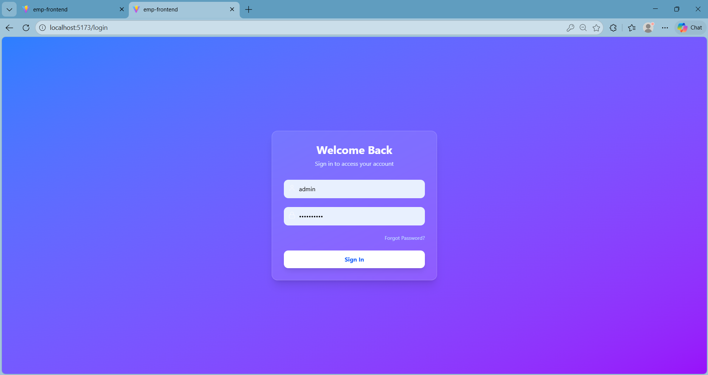
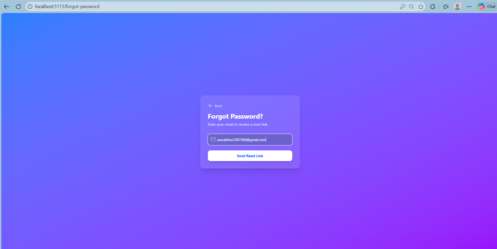
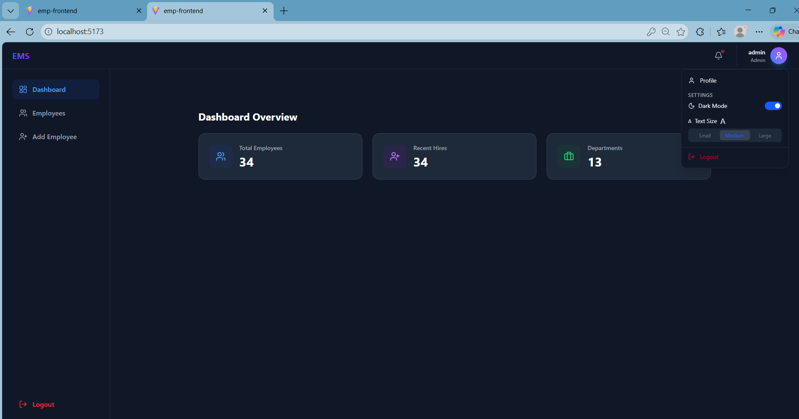
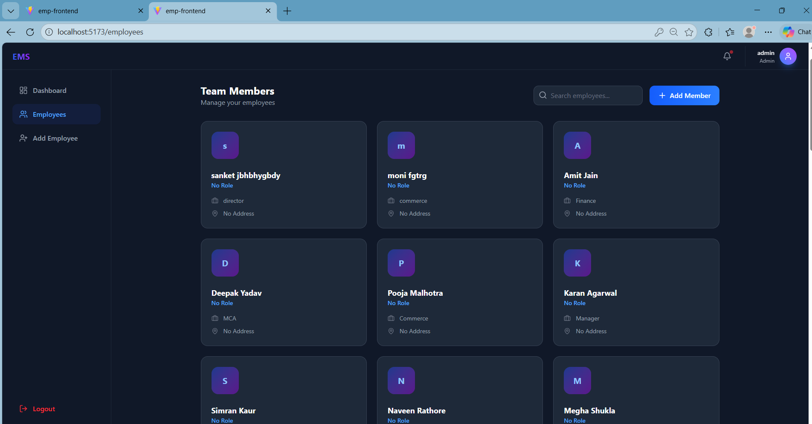
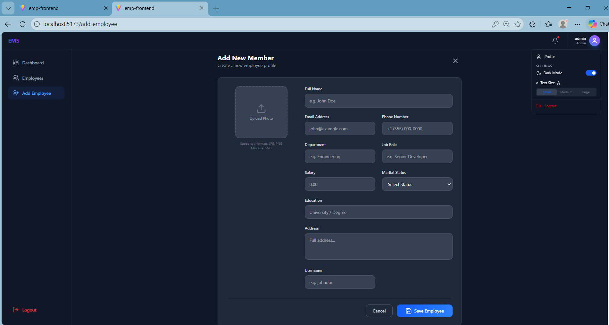
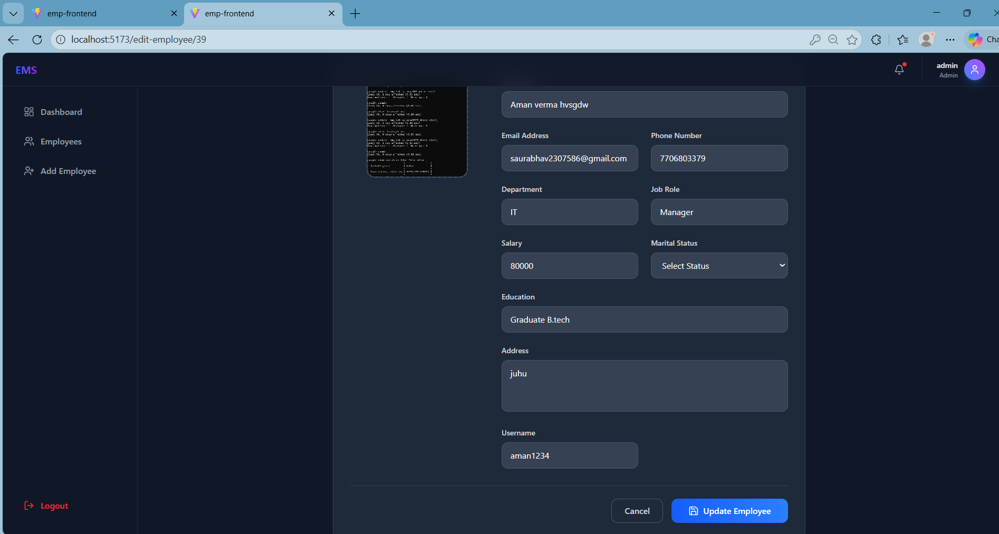
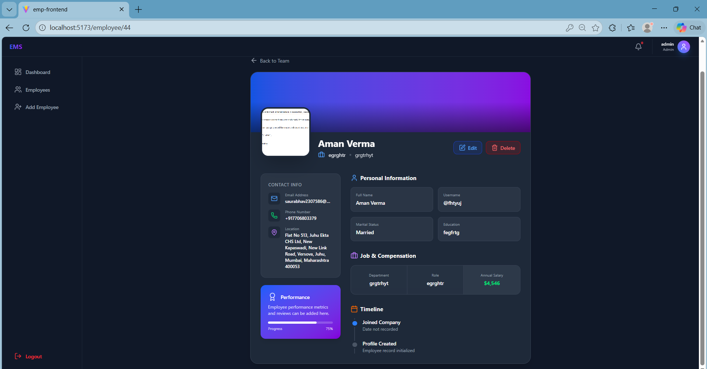
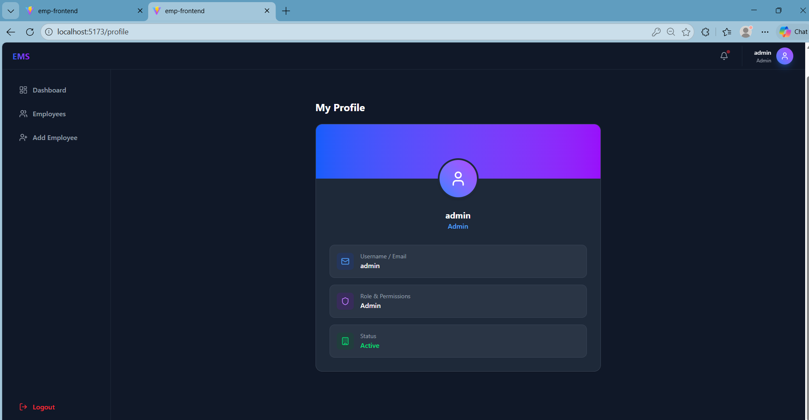

# 🚀 Employee Management System


A comprehensive, full-stack **Employee Management System (EMS)** built using **Spring Boot, React, and MySQL**.  
This system streamlines HR operations with secure authentication, employee lifecycle management, and a modern responsive UI.

---

## ✨ Key Features

### 🔐 Authentication & Security
- JWT-based authentication
- Role-based access control
- Secure password hashing
- Forgot password with email-based reset token
- Protected backend APIs

### 👥 Employee Management
- Add new employees
- View employee details
- Edit employee information
- Delete employees
- Search & filter employees
- Upload employee profile photo

### 📊 Dashboard Overview
- Total employees counter
- Recent hires counter
- Departments overview
- Dark / Light mode toggle
- Adjustable text size

### 🎨 Modern UI
- Glassmorphism design
- Fully responsive layout
- Smooth animations
- Clean dashboard interface
- Toast notifications

---

## 🛠️ Technology Stack

### 🔙 Backend
- Java 17
- Spring Boot 3+
- Spring Security (JWT)
- Spring Data JPA / Hibernate
- MySQL 8
- JavaMailSender
- Maven

### 🎨 Frontend
- React 18
- Vite
- Tailwind CSS
- React Router
- Axios
- React Toastify
- Lucide React Icons

---

## 📸 Screenshots

### 🔐 Login Page


### 🔑 Forgot Password


### 📊 Dashboard (Dark Mode)


### 🌞 Dashboard (Light Mode)


### 👥 Employees List


### ➕ Add Employee


### ✏️ Edit Employee


### 📄 Employee Details


### 👤 Admin Profile


---

## ⚙️ Getting Started

### ✅ Prerequisites

Make sure you have installed:

- Java JDK 17+
- Node.js & npm
- MySQL Server
- Maven

---

## 📥 Installation Guide

### 1️⃣ Clone Repository

```bash
git clone https://github.com/aman123-cdac/Employee-Management-System.git
cd Employee-Management-System
```

---

### 2️⃣ Database Setup

```sql
CREATE DATABASE employee_db;
```

---

### 3️⃣ Backend Setup

```bash
cd BackEnd/Employee-Management-System
```

Update `src/main/resources/application.properties`:

```properties
spring.datasource.url=jdbc:mysql://localhost:3306/employee_db
spring.datasource.username=your_username
spring.datasource.password=your_password

# JWT Secret
jwt.secret=your_secret_key

# Email Configuration
spring.mail.username=your_email@gmail.com
spring.mail.password=your_app_password
```

Run backend:

```bash
mvn spring-boot:run
```

Backend will run at:

```
http://localhost:8080
```

---

### 4️⃣ Frontend Setup

```bash
cd FrontEnd
npm install
npm run dev
```

Frontend will run at:

```
http://localhost:5173
```

---

## 🔌 API Endpoints

| Method | Endpoint | Description |
|--------|----------|------------|
| POST | `/api/auth/register` | Register new user |
| POST | `/api/auth/login` | Login & get JWT |
| POST | `/api/auth/forgot-password` | Request reset link |
| POST | `/api/auth/reset-password` | Reset password |
| GET | `/api/employees` | Get all employees |
| GET | `/api/employees/{id}` | Get employee by ID |
| POST | `/api/employees` | Add employee |
| PUT | `/api/employees/{id}` | Update employee |
| DELETE | `/api/employees/{id}` | Delete employee |

---

## 🏗️ Project Structure

```
Employee-Management-System
│
├── BackEnd
│   └── Employee-Management-System
│       └── screenshots
│
├── FrontEnd
│
└── README.md
```

---

## 🚀 Future Improvements

- Pagination support  
- Role management panel  
- Audit logs  
- Docker containerization  
- CI/CD integration  
- Analytics charts  

---

## 🤝 Contributing

Contributions are welcome!  
Fork the repository and submit a pull request.

---

## 📄 License

This project is Open Source.  
You are free to use, modify, and distribute.

---

## 👨‍💻 Author

**Aman Verma**

If you like this project, consider giving it a ⭐ on GitHub!
